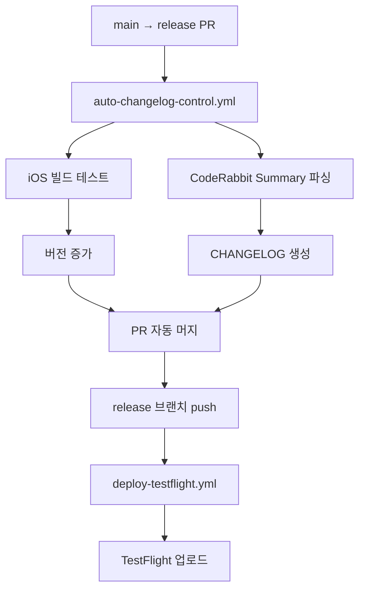

# Wit 프로젝트 GitHub Actions 워크플로우

이 디렉토리는 Wit React Native 프로젝트의 CI/CD 파이프라인을 관리합니다.

## 🚀 활성 워크플로우

### `auto-changelog-control.yml` (메인)

**트리거**: `main` → `release` PR 생성 시  
**기능**:

- 🤖 CodeRabbit Summary 자동 감지 및 파싱
- 🍎 iOS 프로젝트 빌드 테스트
- 📦 버전 자동 증가 (patch)
- 📝 CHANGELOG.json/md 자동 생성
- 📄 README.md, PREVIOUS_CHANGES.md 업데이트
- 🔄 PR 자동 머지
- 🚀 TestFlight 배포 트리거

**작동 순서**:

1. **Job 1**: iOS 빌드 테스트 (우선 실행) → CodeRabbit Summary 감지 → 버전 증가
2. **Job 2**: CHANGELOG 파싱 및 모든 문서 생성
3. **Job 3**: PR 머지 → TestFlight 배포 트리거

### `deploy-testflight.yml`

**트리거**: `release` 브랜치 push 시  
**기능**:

- 🍎 iOS Archive 빌드
- 📱 TestFlight 자동 업로드
- 📝 README.md 최종 업데이트

### `ci-on-main.yml`

**트리거**: `main` 브랜치 push 시  
**기능**:

- ✅ 코드 품질 검사 (ESLint)
- 🧪 단위 테스트 실행

## 📋 비활성화된 워크플로우 (DEPRECATED)

### ~~`build-test.yml`~~ ❌

- **상태**: 비활성화됨
- **이유**: `auto-changelog-control.yml`에 통합됨

### ~~`changelog-update.yml`~~ ❌

- **상태**: 비활성화됨
- **이유**: `auto-changelog-control.yml`에 통합됨

### ~~`release-testflight.yml`~~ ❌

- **상태**: 비활성화됨
- **이유**: 기능이 분산되어 새로운 워크플로우들로 대체됨

## 🔧 워크플로우 사용법

### 1. 새 기능 개발 후 배포

```bash
# 1. 기능 개발 완료 후 main 브랜치에 머지
git checkout main
git pull origin main

# 2. release 브랜치로 PR 생성
git checkout -b temp-release
git push origin temp-release

# GitHub에서 temp-release → release PR 생성
# 🤖 auto-changelog-control.yml이 자동으로:
#   - iOS 빌드 테스트 (우선 실행)
#   - CodeRabbit Summary 대기
#   - 버전 증가 (1.0.52 → 1.0.53)
#   - CHANGELOG 업데이트
#   - PR 자동 머지
#   - TestFlight 배포 트리거
```

### 2. 수동 배포 (긴급 수정)

```bash
# release 브랜치에 직접 push
git checkout release
git pull origin main  # 최신 변경사항 반영
git push origin release  # deploy-testflight.yml 트리거
```

## 📊 워크플로우 의존성



## 🔐 필수 GitHub Secrets

- `PAT_TOKEN`: GitHub Personal Access Token
- `APPLE_ID`: Apple Developer Account ID
- `APP_STORE_CONNECT_API_KEY_ID`: App Store Connect API Key ID
- `APP_STORE_CONNECT_API_ISSUER_ID`: API Issuer ID
- `APP_STORE_CONNECT_API_KEY_CONTENT`: API Key Content (Base64)
- `CERTIFICATE_P12_CONTENT`: iOS Distribution Certificate (Base64)
- `CERTIFICATE_P12_PASSWORD`: Certificate Password
- `PROVISIONING_PROFILE_CONTENT`: Provisioning Profile (Base64)
- `PROVISIONING_PROFILE_SPECIFIER`: Profile Name

## 🐛 트러블슈팅

### CodeRabbit Summary가 감지되지 않는 경우

- PR 생성 후 `@coderabbitai review` 댓글이 자동으로 추가됨
- 최대 10분 대기 후 타임아웃
- 수동으로 CodeRabbit 리뷰 요청 가능

### iOS 빌드 실패 시

- Xcode 프로젝트 파일 자동 수정 기능 내장
- CocoaPods 캐시 자동 정리
- 빌드 실패 시 워크플로우 중단

### 버전 충돌 시

- `rn_version_manager.sh` 스크립트가 자동으로 patch 버전 증가
- `package.json`, `Info.plist`, `build.gradle` 동기화
- Git 태그 자동 생성

## 📝 로그 확인

GitHub Actions 탭에서 각 워크플로우의 상세 로그를 확인할 수 있습니다:

- CodeRabbit Summary 파싱 과정
- iOS 빌드 상태
- 버전 관리 과정
- CHANGELOG 생성 결과

PR 테스트 작업 실행
09/05 23:49
09/06 00:50
09/07 23:41
09/08 03:36
